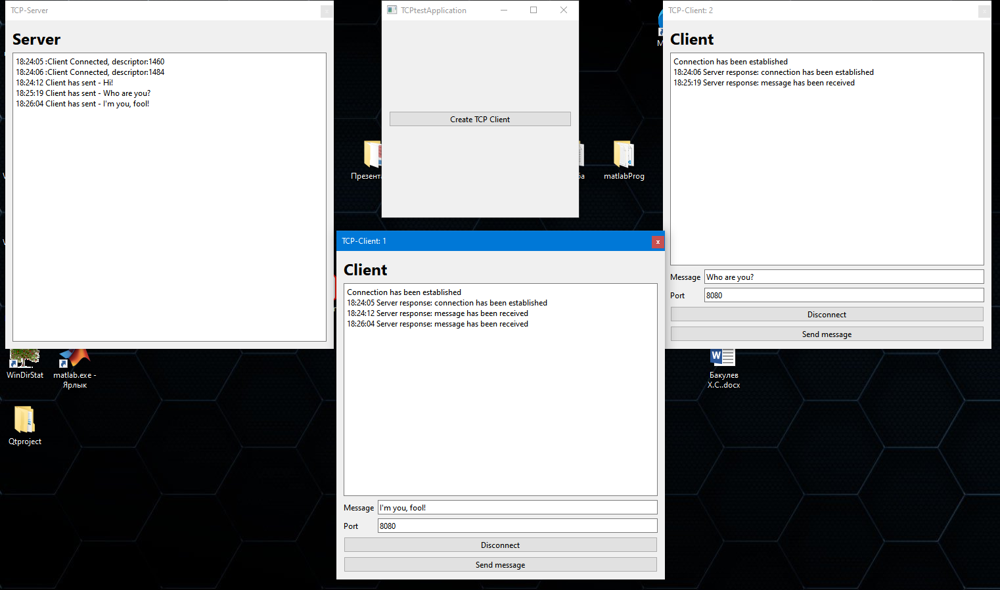

# Учебный проект реализации TCP соединения. 

**Цель работы:** создать приложение в котором каждый клиент будет выполнять в отдельном потоке и будет устанавливать соединение с сервером исполняемым в главном потоке.

**Программа состоит из основных классов:**

* mainwindow - класс реализующимй окно в котором создаются новые клиенты
* ClientWindow - класс реализующий клиенты, внутри себя содержит объект QThread
* ServerWindow - класс реализующий TCP сервера

